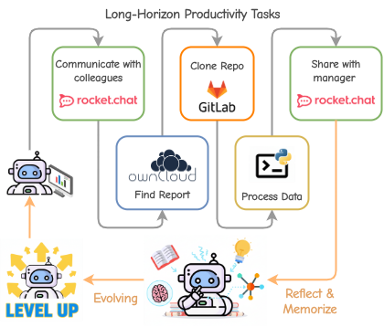
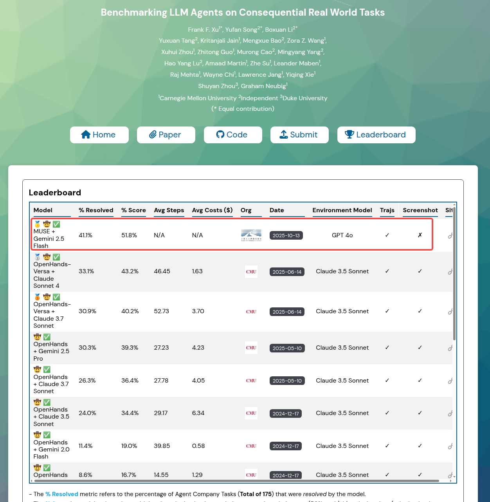

# MUSE 
**Learning on the Job: An Experience-Driven, Self-Evolving Agent for Long-Horizon Tasks**



## 🏆 Benchmark Performance

Our work achieved #1 on The Agent Company Benchmark.



## Quick Start
### 1. Setup Environment
```shell
conda creata -n MUSE python=3.12
conda activate MUSE
pip install -r requirements.txt
playwright install chromium
playwright install-deps chromium
```
### 2. Run Local Demo
```shell
python demo.py
```

## Run TAC Benchmark
To run MUSE on The Agent Company Benchmark, please refer to the guides in https://github.com/KnowledgeXLab/TheAgentCompanyForMuse.
