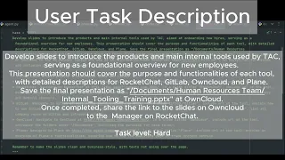
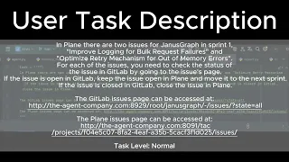

<a name="readme-top"></a>

<div align="center">  
    
</div>  

# 🧠 MUSE: A Memory-Utilizing and Self-Evolving Agent

> **Learning on the Job: An Experience-Driven, Self-Evolving Agent for Long-Horizon Tasks**  
> 📄 [Paper on arXiv (2510.08002)](https://arxiv.org/abs/2510.08002)

---

## ✨ Abstract  

Large Language Models have demonstrated remarkable capabilities across diverse domains, yet significant challenges persist when deploying them as AI agents for real-world long-horizon tasks. Existing LLM agents suffer from a critical limitation: they are test-time static and cannot learn from experience, lacking the ability to accumulate knowledge and continuously improve on the job. To address this challenge, we propose MUSE, a novel agent framework that introduces an experience-driven, self-evolving system centered around a hierarchical Memory Module. MUSE organizes diverse levels of experience and leverages them to plan and execute long-horizon tasks across multiple applications. After each sub-task execution, the agent autonomously reflects on its trajectory, converting the raw trajectory into structured experience and integrating it back into the Memory Module. This mechanism enables the agent to evolve beyond its static pretrained parameters, fostering continuous learning and self-evolution. We evaluate MUSE on the long-horizon productivity benchmark TAC. It achieves new SOTA performance by a significant margin using only a lightweight Gemini-2.5 Flash model. Sufficient Experiments demonstrate that as the agent autonomously accumulates experience, it exhibits increasingly superior task completion capabilities, as well as robust continuous learning and self-evolution capabilities. Moreover, the accumulated experience from MUSE exhibits strong generalization properties, enabling zero-shot improvement on new tasks. MUSE establishes a new paradigm for AI agents capable of real-world productivity task automation.

---

## 🏆 Benchmark Performance

MUSE ranks **#1** on [The Agent Company Benchmark Leaderboard](https://the-agent-company.com/#/leaderboard).

<div align="center">  
    
</div>  

---

## 🚀 Quick Start

### Step 1: Environment Setup

```bash
conda create -n MUSE python=3.12
conda activate MUSE
pip install -r requirements.txt
playwright install chromium
playwright install-deps chromium
```

### Step 2: Run Local Demo

```bash
python demo.py
```

---

## 🗂 核心模块说明

为便于快速上手与二次开发, 下表梳理了仓库中几个核心 Python 文件的职责与关键函数。

### `agent.py`

* **BaseAgent**：封装通用的智能体运行流程, 包括工具加载 (`ToolRegistry.load_tools`)、历史记录管理 (`save_history`) 与 Python 代码执行 (`python_interpreter`).
* **MUSE**：继承自 `BaseAgent`, 组合任务规划、子任务执行、反思与记忆更新的整体闭环, 是系统的入口类。
* **辅助函数**：例如 `create_message`、`safe_json_parse` 等工具方法, 支撑计划生成与工具调用的序列化逻辑。

### `browser.py`

* **BrowserUse**：管理浏览器会话 `_init_browser_session`, 暴露网页交互接口如 `go_to_url`、`click_element_by_index`、`extract_content_by_vision` 等, 供智能体调用。
* **flatten_axtree_to_str**：将浏览器可访问性树展开为易读的字符串, 便于调试页面元素结构。

### `memory_manager.py`

* **MemoryManager**：读取/写入三类长期记忆 (`_load_memory` 与 `_save_memory`), 并在 `update_system_prompt` 中将经验注入系统提示词。
* **轨迹管理函数**：例如 `add_traj`、`trim_traj`、`save_run_artifacts`, 用于维护对话历史与产出运行报告。

### `model.py`

* **LLM**：对接 OpenAI 兼容接口, 负责构造请求 (`prepare_messages`), 发起一次性或流式生成 (`async_generate`, `async_stream_generate`) 并统计 Token 消耗 (`_accumulate_usage`).
* **image_to_base64**：辅助多模态调用, 将截图编码后注入消息体。

### `run.py`

* **任务入口脚本**：解析命令行参数 (`parse_args`), 初始化 `MUSE` 智能体, 并负责评测流程的日志落盘。

---

## 🧪 Run TAC Benchmark

To evaluate MUSE on **The Agent Company Benchmark**, please follow the detailed setup in:
👉 [TheAgentCompanyForMuse Repository](https://github.com/KnowledgeXLab/TheAgentCompanyForMuse)

---

## 🎥 Demo Showcase

**Task 1:** *HR - Internal Tooling Slides*

<p align="center">
  <a href="https://www.youtube.com/watch?v=8pK3SP0ZG4k&feature=youtu.be">
    
  </a>
</p>

**Task 2:** *PM - Updates Plane Issue from GitLab Status*

<p align="center">
  <a href="https://www.youtube.com/watch?v=hsM0FB9uVhs&feature=youtu.be">
    
  </a>
</p>

